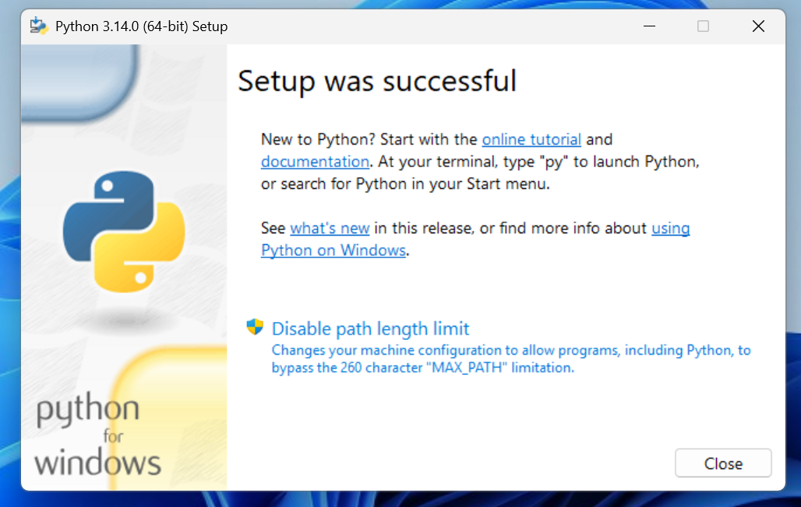
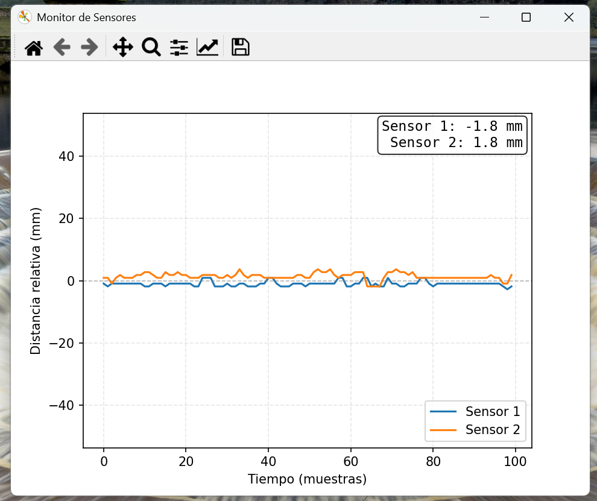
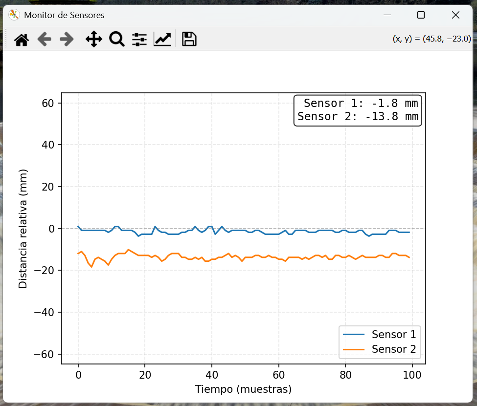
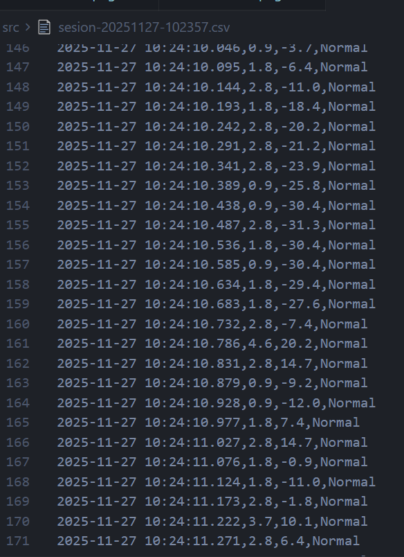
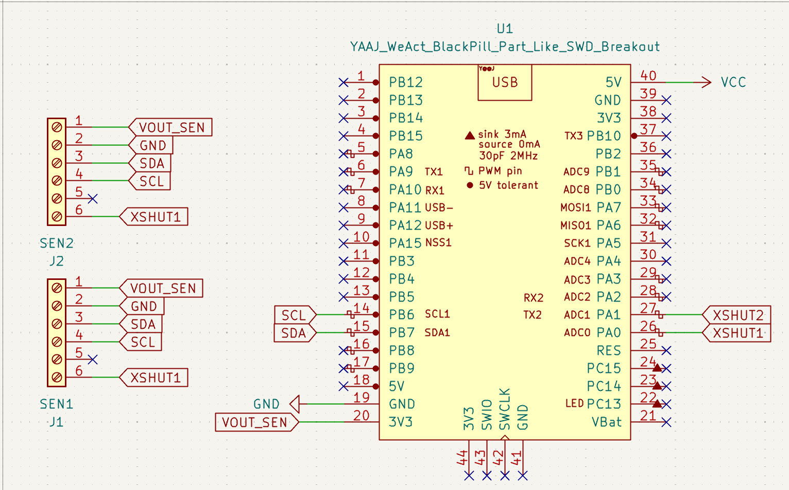

# Instrucciones

Este programa funciona **exclusivamente en Windows** y requiere Python **3.14** o superior para su ejecución.

## Instalación de Python

1. Descarga e instala Python para Windows desde la página oficial: [https://www.python.org/downloads/windows/](https://www.python.org/downloads/windows/) 

**Asegúrate de marcar la opción "Add Python to PATH" durante la instalación.**


2. Al finalizar la instalación, selecciona la opción **"Disable path length limit"**.



## Instalación de dependencias

1. Abre una terminal en el directorio raíz del proyecto (puedes usar "Símbolo del sistema" o "PowerShell").

2. Verifica que Python esté instalado correctamente ejecutando:

```bash
python --version
```

El resultado esperado debe ser similar a:

```bash
Python 3.10.0
```
**O una versión superior a 3.10.**

3. Actualiza `pip` (el gestor de paquetes de Python) con el comando: 

```bash
python -m pip install --upgrade pip
```

4. Instala todas las dependencias necesarias utilizando el siguiente comando:

```bash
python -m pip install -r requirements.txt
```

Si este comando no funciona, puedes instalar los paquetes manualmente con:

```bash
python -m pip install pyserial
python -m pip install matplotlib
python -m pip install pyqt5
python -m pip install pyside6
```

## Ejecución del programa

Una vez instaladas las dependencias, puedes ejecutar el programa **únicamente si hay un MRA conectado a la computadora**; de lo contrario, el programa mostrará un error y finalizará su ejecución.

1. Ejecuta el archivo `launcher.exe` haciendo doble clic sobre él o desde la terminal:

```bash
.\launcher.exe
```

La interfaz gráfica aparecerá después de algunos segundos. La primera vez puede tardar más, ya que el programa genera un caché de las librerías. Tras la carga, el programa te pedirá seleccionar un puerto COM para conectarse: 


2. Una vez conectado, el programa mostrará en tiempo real el comportamiento de los sensores; las medidas iniciales deberían estar muy cercanas a 0.



Si esto no ocurre, resetea el circuito desconectándolo y volviéndolo a conectar, dejando los carros en la posición neutral deseada para el "0".



## Generación de archivos CSV

El programa, de forma automática, genera archivos CSV donde se almacenan las lecturas, el estado de los sensores y eventos relevantes (como fallas o reinicios).

La generación y registro de datos es completamente automática, y el archivo se denomina con el siguiente formato:  
`sesion-añomesdia-horaminutosegundo.csv`



## Esquemático


